# 👋 Hey Everyone, I'm Darshana Rajapaksha
### 🚀 Founder of Hoslift | Full-Stack Developer | Creator of Ranu.js

<!-- Visitor Views (Green) -->

  

<!-- Social Links (Unified GitHub Green Theme) -->

  
  
  

---

### 👨‍💻 About Me

<table width="100%">
  <tr>
    <!-- Left Column: About Info -->
    <td width="50%" valign="middle">
      <ul>
        <li>🏢 <b>Founder</b> at <a href="https://hoslift.com">Hoslift</a>.</li>
        <li>🛠️ <b>Full-Stack Developer</b> passionate about modern web tech.</li>
        <li>⚡ Creator of <b><a href="https://github.com/hoslift/ranu.js">Ranu.js</a></b> — high-performance tooling.</li>
        <li>🌍 Based in <b>Sri Lanka</b> 🇱🇰.</li>
        <li>📫 Let's connect: <b>darshana@hoslift.com</b></li>
      </ul>
    </td>
    <!-- Right Column: Live GitHub Stats Card (Green Primary Accent) -->
    <td width="50%" align="center" valign="middle">
      <picture>
     
      </picture>
    </td>
  </tr>
</table>

---

### 🛠️ Tech Stack & Skills

  
  
  
  
  
  
  

---

### 📊 GitHub Activity & Statistics

<table width="100%">
  <tr>
    <!-- Left Column: Profile Details & Activity Graph (Green Accent) -->
    <td width="50%" align="center" valign="middle">
      <picture>
        <source media="(prefers-color-scheme: dark)" srcset="https://github-profile-summary-cards.vercel.app/api/cards/profile-details?username=draj256&theme=github_dark">
        <source media="(prefers-color-scheme: light)" srcset="https://github-profile-summary-cards.vercel.app/api/cards/profile-details?username=draj256&theme=github">
        
      </picture>
    </td>
    <!-- Right Column: Streak Stats (Green Accent) -->
    <td width="50%" align="center" valign="middle">
      <picture>
       
      </picture>
    </td>
  </tr>
</table>

---

<!-- GitHub Profile by draj256 -->
