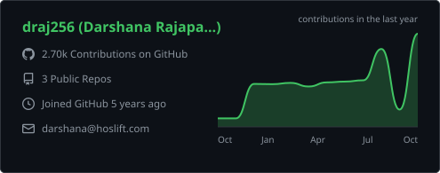
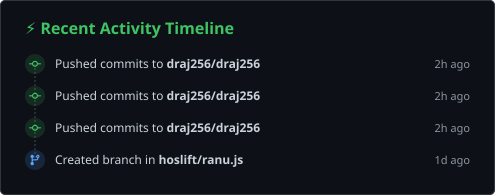
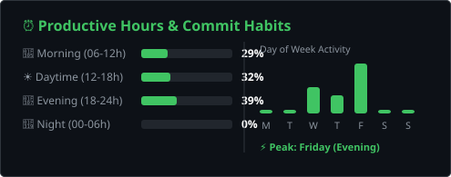
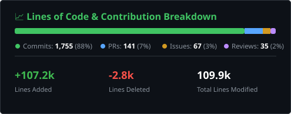
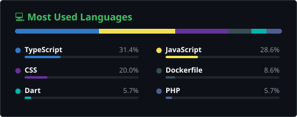
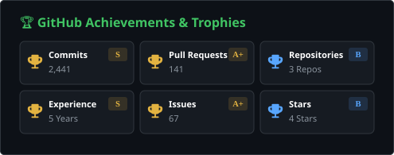

# 👋 Hey Everyone, I'm Darshana Rajapaksha
### 🚀 Founder of Hoslift | Full-Stack Developer | Creator of Ranu.js

<!-- Status Badge -->

  

<!-- Social Links -->

  
  
  

---

## 👨‍💻 About Me

I'm the founder of **[Hoslift](https://hoslift.com)** and a **Full-Stack Developer** interested in building useful, dependable software.

My work spans web development, digital products, cloud infrastructure, and open source. I enjoy turning ideas into practical systems and improving them through thoughtful engineering.

- 🌍 **Based in:** Sri Lanka 🇱🇰
- 🏢 **Building:** Digital experiences and software at **[Hoslift](https://hoslift.com)**
- ⚡ **Open source:** Creator of **[Ranu.js](https://github.com/hoslift/ranu.js)**
- 📫 **Contact:** **[darshana@hoslift.com](mailto:darshana@hoslift.com)**

---

## 🎯 Focus Areas

- 🌐 **Digital products** — websites, web applications, and tailored software solutions
- ⚙️ **Full-stack development** — building across frontend and backend systems
- 📦 **Open source** — developing tools and frameworks for the wider developer community
- ☁️ **Cloud and infrastructure** — deployment, hosting, and systems architecture

---

## 🚀 Featured Project

### ⚡ **[Ranu.js](https://github.com/hoslift/ranu.js)**

A TypeScript-focused, full-stack framework project developed under Hoslift.

I'm building Ranu.js with an emphasis on a cohesive developer experience, practical full-stack workflows, and a growing open-source ecosystem.

 

---

## 🛠️ Tech Stack & Skills

  
  
  
  
  
  
  

---

## 📊 GitHub Analytics & Activity Suite

<table width="100%">
  <!-- Row 1: Overall Stats & Streak (Core Highlights) -->
  <tr>
    <td width="50%" align="center" valign="middle">
      
    </td>
    <td width="50%" align="center" valign="middle">
      
    </td>
  </tr>
  <!-- Row 2: Profile Details Curve & Recent Activity Timeline -->
  <tr>
    <td width="50%" align="center" valign="middle">
      
    </td>
    <td width="50%" align="center" valign="middle">
      
    </td>
  </tr>
  <!-- Row 3: Productive Habits & Lines of Code Breakdown -->
  <tr>
    <td width="50%" align="center" valign="middle">
      
    </td>
    <td width="50%" align="center" valign="middle">
      
    </td>
  </tr>
  <!-- Row 4: Top Languages & Achievements/Trophies -->
  <tr>
    <td width="50%" align="center" valign="middle">
      
    </td>
    <td width="50%" align="center" valign="middle">
      
    </td>
  </tr>
</table>

---

<!-- GitHub Profile by draj256 -->
